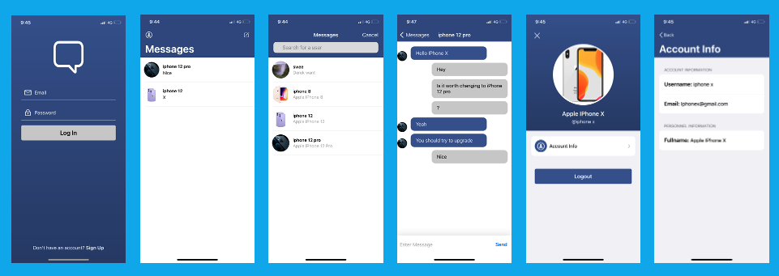
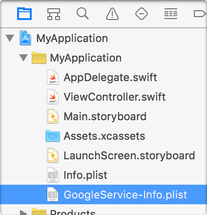

<p align="center">
  
  
  
</p>

<p align="center">
  <a href="https://apps.apple.com/sg/app/mental-math-math-trainer/id1538276170">
    
  </a>

  <h3 align="center">FireChat - Powered by Firebase</h3>

  <p align="center">
    An iOS Application for messaging with Push Notification
    <br />
    <br />
    <a href="https://apps.apple.com/us/developer/chua-kwang/id1464828215s">Not Available in App Store Available in App Store</a>
    <br />
    <br />
    <a href="https://github.com/Sweekwang/FireChat-iOS/issues">Report Bug</a>
    ·
    <a href="https://github.com/Sweekwang/FireChat-iOS/issues">Request Feature</a>
  </p>
</p>

<hr/>

<!-- TABLE OF CONTENTS -->
<details open="open">
  <summary>Table of Contents</summary>
  <ol>
    <li>
      <a href="#about-this-project">About this Project</a>
      <ul>
        <li><a href="#firechat-features">FireChat Features</a></li>
      </ul>
    </li>
    <li>
      <a href="#installation-and-setup-instructions">Installation and Setup Instructions</a>
        <ul>
        <li><a href="#1-installation">Installation</a></li>
        <li><a href="#2-project-step-up">Project Step up</a></li>
        <li><a href="#3-firebase-setup">Firebase Setup</a></li>
      </ul>
    </li>
    <li><a href="#Credits">Credits</a></li>
    <li><a href="#license">License</a></li>
    <li><a href="#contact">Contact</a></li>
  </ol>
</details>

## About this Project


This app was create for me to learn about Model–view–viewmodel(MVVC), build UIKit's user interface programmatically without storyboard and also, push notification from a user's device to another user's device. Also, sending mess notification for marketing purposes. Account is registered using Firebase Authentication and account information are store in Cloud Firestore. User profile image is stored in Cloud Storage and Firebase Cloud message is used to push notification.

#### FireChat Features

1. Registering new Account.
2. Logging in.
3. Live update messaging.
4. Push notification when a user send a message.
5. Push notification from admin to all the user.
6. Viewing account information.

## Installation and Setup Instructions
This application uses [Cocoapods](https://guides.cocoapods.org/using/getting-started.html) and ensure that you have Cocoapods installed in your machine. Moreover, this project uses [Firebase](https://firebase.google.com/l) for Firestore, Storage and Cloud Messaging. Thus, you have to include your [GoogleService-Info.plist](https://firebase.google.com/docs/ios/setupl) for Firestore and Storage and [Server key](https://firebase.google.com/docs/cloud-messaging/server) for Cloud Messaging.

### 1. Installation
Ensure that you have installed all the dependecies for this project. After Cocoapods is installed, open up your terminal and cd to the folder directory of this project and type:
```
pod install
```

Once install, you can open up the FireChat project. White Color Icon (Not the Blue color icon project).

### 2. Project Step up
#### 2.1 Update the Bundle Identifier and Team.
Ensure that you have change the bundle identifier and team of this project. Click FireChat > Signing and Capabilities > Bundle Identifier and then Team.

#### 2.2 Setting up a new project Identifier
This is to allow push notification for the app.

1. Head over to [Apple]((https://developer.apple.com/) and click on **Account**.
2. Click on **Certificates, IDs & Profiles**
3. Go to **Identifiers**
4. Click on the add button add new **identifier**
    Select App IDs > App > **Add the Bundle ID** you have created in this project and **Enabled Push Notifications**
    
#### 2.3 Establish connectivity between Cloud Messaging and the Apple Push Notification service (APNs authentication key)

1. At the  [Apple](https://developer.apple.com/)'s **Certificates, IDs & Profiles**.
2. Go to Keys and click on the **add button**.
3. Enable Apple Push Notifications Service APNs. You can give any Key Name.
4. Remember the **Key ID** and download **.p8** file this will be used for firebase setup.

### 3. Firebase Setup
Before you start here, ensure that you have the **Key ID** in step 2.3.
1. Go to [Firebase](https://firebase.google.com/) and start new Project.
2. Follow the steps. Disable Google Analytics as this project will not be using it.
3. Click on **iOS** icon to get started. Follow the step
4. Download **GoogleService-Info.plist** and continue. You do not need to add the Firebase SDK or  initialization code as I had already did it.



#### 3.1 Firebase Authentication Setup
1. On the left panel of Firebase console, click on **Authentication**
2. Click on **get started**
3. Go to Sign-in method and enable **Email/Password**

#### 3.2 Cloud Firestore Setup
1. On the left panel of Firebase console, click on **Firestore**
2. Click on **Create database**
3. Go to Sign-in method and enable **Email/Password**
4. Select **start in production mode** and choose the location you want.

#### 3.3 Cloud Messing Setup
1. On the left panel of Firebase console, click on **Setting icon** > **Project Setting**
2. Click on **Cloud Messaging**
3. Go to APNs **Authentication Key**. Click on **Upload** . Drag the **.p8** file you have download in step 2.3 and add the **Key ID** you and created at step 2.3. Also add your Apple Team ID.
4. Scroll up and go find the **Server key**. Copy the server key and go to **PushNotificationSender.swift** at the API folder and change the server constant to the server key you have coplied.

Now, you are good to go.

## Credits
This project is part of a course from [Stephan Dowless]("https://www.udemy.com/user/stephan-dowless/"). However, some modifications were made:

1. Added Account Information ViewController.
2. Added push notification.
3. Changed colors.
4. Added App Icons.
3. Removed Setting Table Cell.

As some of the stuff was not taught in the course to made a full functional messaging app, also setting tableview cell was not doing anything and serve no purposes.


## License
MIT License

Copyright (c) [2021] [CHUA SWEE KWANG]

Permission is hereby granted, free of charge, to any person obtaining a copy of this software and associated documentation files (the "Software"), to deal in the Software without restriction, including without limitation the rights to use, copy, modify, merge, publish, distribute, sublicense, and/or sell copies of the Software, and to permit persons to whom the Software is furnished to do so, subject to the following conditions:

The above copyright notice and this permission notice shall be included in all copies or substantial portions of the Software.

THE SOFTWARE IS PROVIDED "AS IS", WITHOUT WARRANTY OF ANY KIND, EXPRESS OR IMPLIED, INCLUDING BUT NOT LIMITED TO THE WARRANTIES OF MERCHANTABILITY, FITNESS FOR A PARTICULAR PURPOSE AND NONINFRINGEMENT. IN NO EVENT SHALL THE AUTHORS OR COPYRIGHT HOLDERS BE LIABLE FOR ANY CLAIM, DAMAGES OR OTHER LIABILITY, WHETHER IN AN ACTION OF CONTRACT, TORT OR OTHERWISE, ARISING FROM, OUT OF OR IN CONNECTION WITH THE SOFTWARE OR THE USE OR OTHER DEALINGS IN THE SOFTWARE.

## Contact
[linkedin](https://www.linkedin.com/in/chuasweekwang/) · [Instagram](https://www.instagram.com/sweekwang/)
 

Copyright (c) [2021] [CHUA SWEE KWANG]
